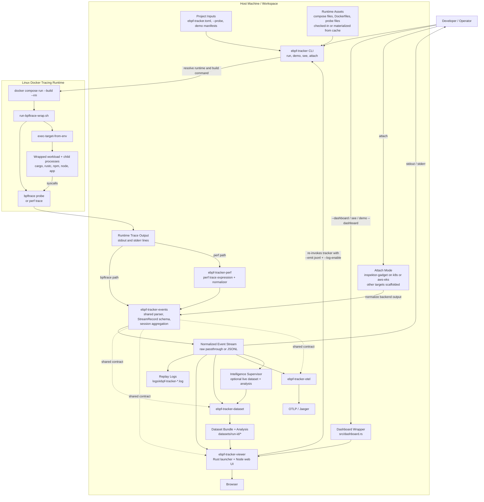

# Architecture

## Notes

- `ebpf-tracker` is the orchestration entry point. It resolves runtime, config, transport, logging, demo assets, and dashboard mode before launching the traced session.
- The default collection path is `bpftrace` inside a privileged Docker runtime. The alternate transport is `perf trace`, normalized through `ebpf-tracker-perf`.
- `ebpf-tracker-events` is the shared contract across the workspace. It defines the `StreamRecord` JSONL schema and the session aggregation model consumed by the viewer, dataset, and OTel crates.
- `ebpf-tracker-viewer`, `ebpf-tracker-dataset`, and `ebpf-tracker-otel` are downstream consumers of the same normalized event stream.
- `attach` is a parallel entry path for live targets like `k8s` and `aws-eks`; it bypasses the Docker runtime and normalizes backend output into the same event model.
